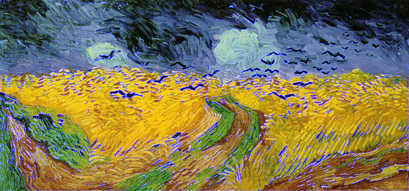

---
editor_options:
  chunk_output_type: console
output:
  html_document: default
  pdf_document: default
---
# STAT 327 003 Homework 3


Name: Zhuoyan Xu

Email: zxu444@wisc.edu

 This homework is about implementing a parallel mean filter for image smoothing.

### Part 0: Require package, preprocess the image
This part is about require the package, and read the image into three channel martix(red,green,blue).
```{r}
if (!require("png")) {
  install.packages("png")
  stopifnot(require("png"))
}
str(ima <- readPNG("Van_Gogh.png"))
ima = readPNG("Van_Gogh.png")
dim(ima)
ima_red = ima[,,1]
ima_green = ima[,,2]
ima_blue = ima[,,3]

image(t(ima_red[nrow(ima_red):1,]),col = gray((1:12)/13),main = "red channel")

```


This is one showedred channel  image for example.


### Part 1: Create function

This is the fuilter function which has two arguments:matrix and k(edge width of filter). This function can do following steps:
Store the dimensions of the matrix. Pad it with zeros, moving window around and take averages, crop the padding, finally return filtered matrix.

```{r}
filter = function(mat,k=1){
  nrow = dim(mat)[1]
  ncol = dim(mat)[2]
  pad = matrix(0,nrow + 2*k, ncol + 2*k)
  pad[ (k+1):(nrow + k),(k+1):(ncol + k)  ] = mat
  mat2 = pad
  for(i in (k+1):(nrow + k)){
    for(j in (k+1):(ncol + k)){
      mat2[i,j] = mean(pad[(i-k):(i+k),(j-k):(j+k)])
    }
  }
  mat2 = mat2[ (k+1):(nrow + k),(k+1):(ncol + k)  ]
  return(mat2)
}
```

### Part 2: Got processed matrix into filtered function
This part is use filter matrix to filter the matrix we got in the image. We do this in 3 cores.
```{r}
ima_li = list(ima[,,1],ima[,,2],ima[,,3])

## unicore == lapply(ima_li,filter)

require("parallel")
n_cores = detectCores()
cluster = makePSOCKcluster(names=3)

## clusterMap usage is the same as mapply
## parLapply usage is the same as lapply

filtered_list1 = parLapply(cl = cluster, fun = filter,X = ima_li)  ## k=1
filtered_list3 = parLapply(cl = cluster, fun = filter,X = ima_li,k=3) ## k=3
filtered_list5 = parLapply(cl = cluster, fun = filter,X = ima_li,k=5) ## k=5


stopCluster(cl=cluster)
```


### Part 3: Assemble the mareix into 3 dimensional array()
This part is assemble the matrix into array, the array must be three dimensions(cause three channels, each channel has one matrix).
```{r}
### assemble

final_array1 = array(c(filtered_list1[[1]],filtered_list1[[2]],filtered_list1[[3]]),dim = dim(ima))

final_array3 = array(c(filtered_list3[[1]],filtered_list3[[2]],filtered_list3[[3]]),dim = dim(ima))

final_array5 = array(c(filtered_list5[[1]],filtered_list5[[2]],filtered_list5[[3]]),dim = dim(ima))

```

### Part 4: write imagesand show
This part is using the writePNG function write array into image and stored in working sirectory files.
```{r}

### write
writePNG(final_array1,"zxu_1.png")
writePNG(final_array3,"zxu_3.png")
writePNG(final_array5,"zxu_5.png")

```
##### show


### Part 5: Detect edges
```{r}

#################  detect edges
filter_sd = function(mat,k=1){
  nrow = dim(mat)[1]
  ncol = dim(mat)[2]
  pad = matrix(0,nrow + 2*k, ncol + 2*k)
  pad[ (k+1):(nrow + k),(k+1):(ncol + k)  ] = mat
  mat2 = pad
  for(i in (k+1):(nrow + k)){
    for(j in (k+1):(ncol + k)){
      mat2[i,j] = sd(pad[(i-k):(i+k),(j-k):(j+k)])
    }
  }

  mat2 = mat2[ (k+1):(nrow + k),(k+1):(ncol + k)  ]
  ## identify edge
 # mat2[mat2 > quantile(mat2,1-top)] = 1    ##   identify edge by select top 1% or 10% 
                                       ##  values in matrix and replace them by 1 
  return(mat2)
}
#filter_sd(matrix(1,2,2))

read_image = function(file_name)
{
  ima = readPNG(file_name)
  #dim(ima)
  ima_red = ima[,,1]
  ima_green = ima[,,2]
  ima_blue = ima[,,3]
  
  dim_original = dim(ima)
  ima_li = list(ima[,,1],ima[,,2],ima[,,3])
  return(list(ima_li,dim_original))   ## return list and original array                                                    # dimension
}

## cores: the number of cores to be used
## ima_li list to be apply filter function
## top: percentage pixesto be replaced by 1
## dim_final: the dimension final array(the one can be used on the writePNG)
filter_assemble_edge = function(cores,ima_li,dim_final)
{
  require("parallel")
  #n_cores = detectCores()
  cluster = makePSOCKcluster(names=cores)

  filtered_list = parLapply(cl = cluster,fun = filter_sd,X = ima_li)
  stopCluster(cl=cluster)
  
  ### assemble
  final_array = array(c(filtered_list[[1]],filtered_list[[2]],filtered_list[[3]]),
                      dim = dim_final)
  
  return(final_array)
}


```

#### Detect edges for Van_Gogh
```{r}
ima_li_Van = read_image('Van_Gogh.png')[[1]]
dim_final = read_image('Van_Gogh.png')[[2]]
final_array_Van = filter_assemble_edge(3,ima_li_Van,dim_final)
mat2 = final_array_Van[,,1]
top = 0.1
ima_li_Van[[3]][mat2 > quantile(mat2,1-top)] = 1 
final_array_Van = array(c(ima_li_Van[[1]],ima_li_Van[[2]],ima_li_Van[[3]]),
                      dim = dim_final)
### write
writePNG(final_array_Van,"edge_Van.png")

```



When I choose top pixes to be 1%, then the bird was highlighted.

Then I choose top pixes to be 0.1, all the edge is detected(including birds and roads), it has been highlight in white. This is because I chooose the top 10% high pixes to be 1.


#### Detect edges for Madison
```{r}
ima_li_Van = read_image('Madison.png')[[1]]
dim_final = read_image('Madison.png')[[2]]
final_array_Van = filter_assemble_edge(3,ima_li_Van,dim_final)

### replace by 1
top = 0.1
mat2 = final_array_Van[,,1]
ima_li_Van[[1]][mat2 > quantile(mat2,1-top)] = 1 

mat2 = final_array_Van[,,2]
ima_li_Van[[2]][mat2 > quantile(mat2,1-top)] = 1 

mat2 = final_array_Van[,,3]
ima_li_Van[[3]][mat2 > quantile(mat2,1-top)] = 1 

final_array_Van = array(c(ima_li_Van[[1]],ima_li_Van[[2]],ima_li_Van[[3]]),
                      dim = dim_final)
### write
writePNG(final_array_Van,"edge_Madison.png")

```


I choose top pixes to be 0.1, the edge is detected, is ti be highlight in white.
In the map, the edge of house and the street is been emphasized.


